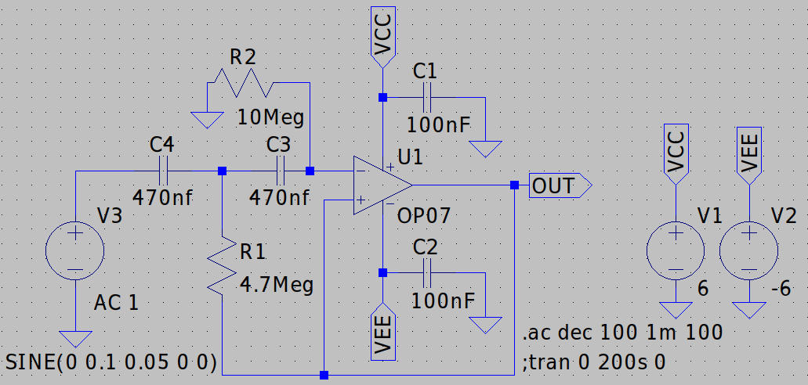
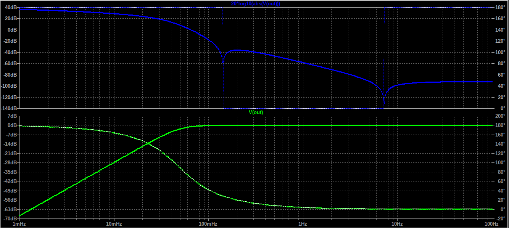

# Proyek Bio-Instrumentasi EKG Wireless (HPF 0.05 Hz)

Proyek ini berfokus pada desain sistem pemantauan EKG (Elektrokardiogram) menggunakan **ESP32 LoRa TTGO** dan **Modul AD8232**, yang didahului oleh rangkaian filter aktif analog yang presisi.
Bagian ini mendokumentasikan desain dan verifikasi **High-Pass Filter (HPF)** Orde 2 untuk menghilangkan *Baseline Wander*.

## 1. Tujuan HPF

Tujuan utama dari HPF ini adalah untuk menghilangkan komponen frekuensi sangat rendah (di bawah 0.5 Hz), yang dikenal sebagai **Baseline Wander** (pergeseran garis dasar) yang disebabkan oleh pernapasan dan gerakan pasien, memastikan sinyal EKG jantung berada pada titik acuan yang stabil.

## 2. Desain Rangkaian HPF 0.05 Hz

Rangkaian HPF menggunakan topologi **Sallen-Key Orde 2** dengan penguatan (gain) kesatuan (*unity gain*) untuk mencapai *slope* redaman -40 dB/dekade di bawah frekuensi *cut-off*.

**Skematik Rangkaian:**

| Komponen | Nilai | Tujuan |
| :--- | :--- | :--- |
| **R1** | 4.7 M | Penentu Frekuensi |
| **R2** | 10  M | Penentu Frekuensi |
| **C1** | 470 nF | Penentu Frekuensi |
| **C2** | 470 nF | Penentu Frekuensi |

## 3. Verifikasi Perhitungan Teoritis

Frekuensi *cut-off* teoritis ($f_c$) dihitung menggunakan rumus karakteristik untuk filter Sallen-Key Orde 2 dengan nilai komponen yang berbeda:

$$\mathbf{f_c = \frac{1}{2\pi \sqrt{R_1 R_2 C_1 C_2}}}$$

### Hasil Perhitungan:

$$f_c = \frac{1}{2\pi \sqrt{(4.7 \times 10^6) \times (10 \times 10^6) \times (470 \times 10^{-9}) \times (470 \times 10^{-9})}}$$

$$f_c \approx \mathbf{0.04939 \text{ Hz}}$$

**Kesimpulan:** Nilai teoritis **0.049 Hz** sangat sesuai dengan target desain $\mathbf{0.05 \text{ Hz}}$.

## 4. Hasil Simulasi Bode Plot (LTSpice)

Simulasi *Bode Plot* dilakukan untuk memverifikasi kinerja frekuensi HPF.

### Visualisasi Plot:

### Analisis Hasil:

| Karakteristik | Target Desain | Hasil Simulasi (Plot Hijau) |
| :--- | :--- | :--- |
| **Frekuensi Cut-off ($\mathbf{f_c}$)** | 0.05 Hz (50 mHz) | Gain mencapai **-3 dB** tepat pada **50 mHz**. |
| **Passband Gain** | 0 dB | Gain mendatar di **0 dB** pada frekuensi di atas 0.1 Hz. |
| **Slope** | +40 dB/dekade (Orde 2) | Terlihat kemiringan yang curam (+40 dB/dekade) di bawah $f_c$. |
| **Kesimpulan** | Sesuai | HPF berfungsi dengan akurat untuk memotong frekuensi di bawah 0.05 Hz. |

---

**Next Topic:** Verifikasi LPF 100 Hz dan BSF 50 Hz.

**Lihat juga:**

* [Kode Python untuk Verifikasi Fungsi Alih HPF](link_ke_file_python_anda)
* [Skematik Rangkaian Filter Gabungan](img/image_6cce5e.png)
